# Computing History timeline

A história da computação é uma narrativa fascinante que abrange séculos de desenvolvimento, inovação e avanço tecnológico. A palavra "computar" tem uma origem deriva do latim "computare", que significa "calcular" ou "contar". A ideia por trás da computação está relacionada ao processamento de dados e à realização de operações matemáticas. A palavra "computar" em si também tem essa origem latina, significando "calcular" ou "somar". Os computadores são aparelhos eletrônicos que armazenam dados para processar informações que podemos transformar em conhecimento. A palavra `informática` vem da junção das palavras **infor**mação e auto**mática**

A primeira invenção que se tem registro é o Ábaco (3000 a.C.). O ábaco, é um dispositivo de cálculo manual, utilizado para realizar operações aritméticas. Ele foi amplamente utilizado em várias culturas antigas, como a Babilônia, a China e o Egito.

    
<b>Fígura 1</b> - Ábaco

     
    
<b>Fonte:</b> (Sousa, Roney - 2019)

 

Máquinas de Cálculo Mecânicas (séculos XVII-XIX). Blaise Pascal (1642) e Gottfried Wilhelm Leibniz (1673) desenvolveram calculadoras mecânicas rudimentares. Charles Babbage, no século XIX, projetou as "Máquinas Analíticas" e "Máquinas Diferenciais", consideradas os primeiros conceitos de computadores programáveis.

    
<b>Fígura 2</b> - Máquinas de Cálculo Mecânicas de Blaise Pascal

    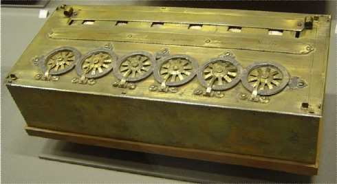 
    
<b>Fonte:</b> ( Gugik, Gabriel - 2019)

 

    
<b>Fígura 3</b> - Máquinas de Cálculo Mecânicas de Leibniz

    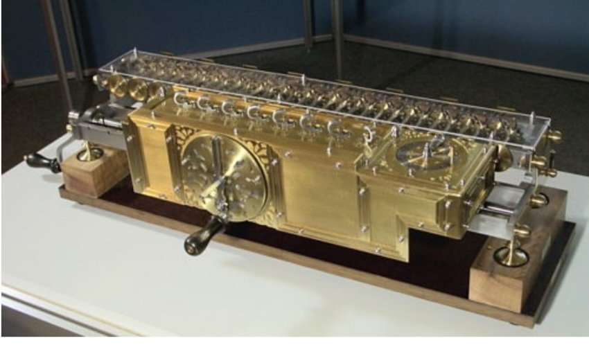 
    
<b>Fonte:</b> ( Gugik, Gabriel - 2019)

 

    
<b>Fígura 4</b> - Tabuladora  de Herman Hollerith

    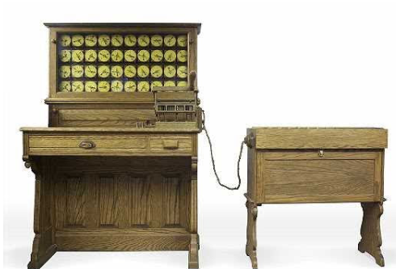 
    
<b>Fonte:</b> ( Gugik, Gabriel - 2019)

 

    
<b>Fígura 5</b> - Máquinas analítica de Charles Babbage

    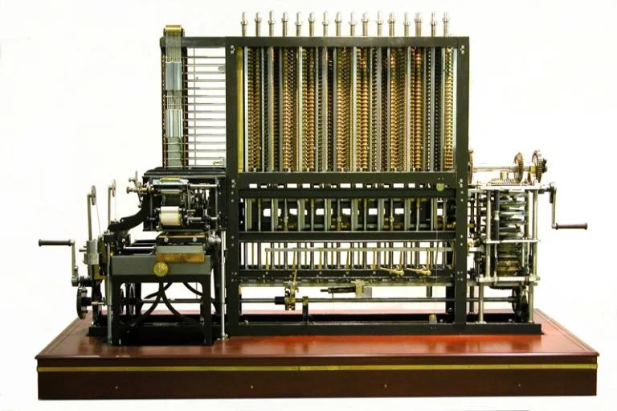 
    
<b>Fonte:</b> ( Gugik, Gabriel - 2019)

 

Teoria da Computação (1930): O matemático britânico Alan Turing formulou a Máquina de Turing, um modelo teórico de um computador, que desempenhou um papel crucial na fundação da ciência da computação.

Segunda Guerra Mundial (1939-1945): Durante a guerra, os britânicos desenvolveram a Colossus, a primeira máquina de computação eletrônica, para decifrar códigos alemães. Nos EUA, o ENIAC (Electronic Numerical Integrator and Computer) foi concluído em 1945, sendo o primeiro computador eletrônico de grande escala.

Era dos Transistores (década de 1950): Os transistores, mais eficientes e confiáveis do que as válvulas, começaram a substituir esses componentes nos computadores. Isso resultou em computadores menores, mais rápidos e mais acessíveis.

Desenvolvimento de Linguagens de Programação (década de 1950): Linguagens como Fortran e COBOL foram desenvolvidas para facilitar a programação e tornar os computadores mais acessíveis a uma gama maior de pessoas.

Era dos Circuitos Integrados (década de 1960): A invenção dos circuitos integrados permitiu que muitos componentes eletrônicos fossem integrados em um único chip, aumentando ainda mais a potência dos computadores e reduzindo seu tamanho.

Desenvolvimento dos Microprocessadores (década de 1970): A Intel lançou o primeiro microprocessador, o Intel 4004, em 1971, marcando o início da era dos computadores pessoais.

Computadores Pessoais (década de 1980): O lançamento do IBM PC em 1981 popularizou os computadores pessoais. A Apple também lançou o Macintosh na mesma época.

Expansão da Internet (década de 1990): O surgimento da World Wide Web e o desenvolvimento de navegadores como o Netscape Navigator tornaram a Internet amplamente acessível ao público.

Era Moderna (século XXI): Avanços contínuos em hardware e software levaram ao desenvolvimento de dispositivos móveis, computação em nuvem, inteligência artificial, aprendizado de máquina e tecnologias emergentes.

Essa é uma visão geral simplificada, e a história da computação é repleta de inovações, contribuições e avanços de inúmeras pessoas ao redor do mundo. O campo continua a evoluir rapidamente, moldando a maneira como vivemos, trabalhamos e nos comunicamos.

Os computadores gigantes que ocupavam salas inteiras e necessitavam do auxílio de humanos nasceram lá pela década de 1950. Nessas primeiras máquinas, as tarefas eram realizadas por técnicos, os quais ditavam o que seria realizado através do próprio hardware.

    
<b>Fígura 6</b> - Eniac

    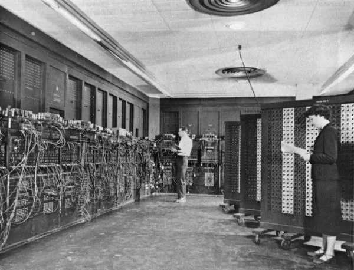 
    
<b>Fonte:</b> (Wikipedia)

 

    
<b>Fígura 7</b> - Eniac

    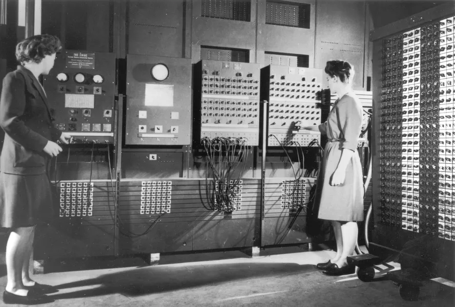 
    
<b>Fonte:</b> (Wikipedia)

 

Um funcionário era contratado especialmente para ativar e desativar chaves, as quais serviam para indicar se um componente devia ficar ligado ou desligado. Ao desligar uma chave, por exemplo, a informação corria por metros ou quilômetros de fio e acendia uma luz, indicando que determinada função estava desativada.

Nessa época, era comum que uma pessoa projetasse e programasse um computador. Apesar de funcionar para as tarefas necessárias, esses PCs necessitavam sempre da intervenção humana e não podiam usar rotinas programadas. A história mudou com o primeiro SO.

1969 - UNIX
Disponível
Código fechado
Na década de 1960, uma equipe de desenvolvedores da AT&T Bell Labs resolveu trabalhar em um software mais objetivo e simplificado do que aquele que era utilizado nos mainframes da época. Após alguns anos, mais precisamente em 1969, o resultado foi o sistema operacional proprietário apelidado de UNIX (Serviço de Computação e Informação Uniplexada).

De início, o sistema foi programado especificamente para um tipo de máquina, mas, em 1973, o software foi recodificado para a linguagem C. Apesar de se tratar de um software com código fechado, a AT&T forneceu cópias para universidades.

1977 - BSD
Indisponível
Inicialmente: código fechado
Atualmente: código aberto
Em 1977, o UNIX teve seu primeiro descendente. Ainda que tivesse características próprias, o BSD estava claramente ligado com seu antecessor, visto que utilizava parte do código-fonte e do design do sistema que foi criado pela AT&T. De início, o sistema era apenas uma extensão do UNIX e agregava algumas poucas funcionalidades.

Assim como seu “pai”, o BSD também adotou a ideia do código fechado (algo que foi mudado décadas depois), mas isso não era exatamente um problema, visto que ele era voltado para o uso em universidade e máquinas de grande porte.

1978 - Apple DOS
Indisponível
Código fechado
O primeiro sistema operacional da Apple veio para equipar os computadores Apple II. Como o próprio nome sugere, este era um sistema que funcionava em discos (época em que não existiam os HDs).

Esse software, que foi desenvolvido por terceiros, era bem rudimentar e contava apenas com alguns componentes básicos: um gerenciador de arquivos, um catálogo, funções para abrir e remover dados, um programa de inicialização e alguns outros elementos.

1979 - Atari DOS
Indisponível
Código fechado
Você provavelmente deve associar este nome com o video game, mas o nome também foi usado para batizar o sistema e os computadores da famosa fabricante de consoles. O software Atari DOS foi usado em toda a família de computadores domésticos de 8-bits da marca.

Assim como os demais sistemas da época, o Atari DOS era muito limitado e trazia algumas ferramentas bem básicas no menu principal. Ele recebeu uma série de atualizações ao longo dos anos, mas seus códigos não chegaram até a atualidade.

1980 - Apple SOS
Indisponível
Código fechado
Com o sucesso de vendas do Apple II, a fabricante, naturalmente, resolveu apostar no Apple III e, consequentemente, necessitou de um sistema evoluído para conquistar o consumidor. Na época, a Maçã optou por um sistema um pouco diferente do antecessor, mas as mudanças não foram tão significativas.

1980 – Xenix
Indisponível
Código fechado
Antes de sequer pensar no MS-DOS, a Microsoft trabalhou um tanto com o Unix. Na verdade, a empresa não desenvolveu o sistema, sendo que todo o desenvolvimento foi feito pela AT&T. Ainda em 1980, a empresa lançou o Xenix para os computadores Zilog Z8000 (os primórdios das máquinas de 16 bits).

Com o passar do tempo, o Xenix se tornou um dos sistemas Unix mais usados por usuários domésticos. Após alguns anos, a Microsoft vendeu os direitos para terceiras (como a Intel e a SCO), pois resolveu trabalhar com o 86-DOS.

1980 - 86-DOS (Q-DOS)
Indisponível
Código fechado
Como o próprio nome sugere, este foi um sistema operacional desenvolvido especialmente para os processadores Intel 8086. Desenvolvido pela Seattle Computer Products, este software não durou muito, pois a Microsoft comprou a ideia e resolveu transformá-lo no MS-DOS.

1981 - MS-DOS / IBM PC DOS
Indisponível
Código fechado
Como você bem deve imaginar, desde os tempos mais primórdios a Microsoft trabalha apenas com softwares. No início, a empresa fez uma parceria com a IBM para vender seu sistema junto com os PCs da empresa.

    
<b>Fígura 7</b> - Eniac

    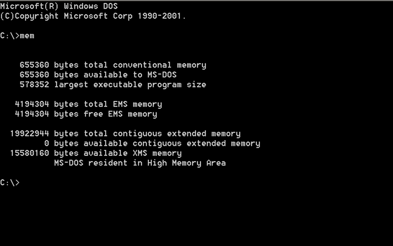 
    
<b>Fonte:</b> (Wikipedia)

 

O software foi muito bem aceito e recebeu modificações ao longo dos anos. Já na versão 2.0, o MS-DOS suportava HDs de 10 MB e estrutura de arquivos “em árvore”. Na próxima etapa, a Microsoft adicionou o FAT16 e suporte para redes. Assim foi o começo do que hoje é o Windows.

1981 – Pilot
Indisponível
Código fechado
A Apple e a Microsoft estavam fazendo grandes progressos com seus softwares, mas foi a Xerox que lançou o primeiro sistema operacional com interface gráfica. A empresa criou o mouse e lançou o Xerox Star para oferecer uma experiência completa para o consumidor.

Apesar de fazer um progresso significativo, o sistema Pilot não foi um sucesso comercial, talvez porque ele era algo isolado e custava muito caro.

1982 – SunOS
Indisponível
Código fechado
Usando o BSD como base, a Sun Microsystems criou seu próprio sistema operacional. O software foi desenvolvido para ser comercializado junto aos servidores e estações de trabalho criados pela companhia. Ele durou um bom tempo e continuou evoluindo, até que a desenvolvedora mudou seu nome para Solaris.

1983 - Apple ProDOS
Indisponível
Código fechado
Depois de tantos projetos, a Apple lançou um sistema mais profissional. Esse novo software foi baseado no Apple SOS e teve alguns problemas que outros sistemas não apresentavam. Todavia, com o lançamento da suíte AppleWorks, a Maçã conseguiu chamar a atenção dos consumidores.

1983 - Lisa OS
Indisponível
Código fechado
Também baseado no antigo Apple SOS, este sistema chegou com uma série de correções e impressionou com sua capacidade de trabalhar com múltiplas tarefas e o recurso de memória virtual. Esses foram aspectos importantes para o software funcionar bem com uma interface gráfica revolucionária.

Além de oferecer as típicas características que existiam no Pilot, o Lisa OS chegou para tornar a usabilidade mais agradável para quem usava o computador em casa. Com um menu superior, a Apple conseguiu conquistar o público.

1984 - HP-UX
Disponível
Código fechado
A Hewlett-Packard já estava há alguns anos no ramo da computação, mas ela demorou a apostar em um sistema operacional próprio. O HP-UX foi o primeiro a trazer um gerenciador de unidades lógicas e listas de controle de acesso. O sistema deu certo e até hoje é uma plataforma Unix disponível para grandes servidores.

1984 - Mac OS
Indisponível
Código fechado
Depois de acertar na interface, a Apple resolveu simplificar as coisas para o consumidor. Muitos dos comandos que amedrontavam os usuários foram removidos e substituídos por gestos do mouse. Este era o começo da era dos computadores “amigáveis”. O Mac OS (que originalmente tinha o nome de System) foi a base do longo sucesso da Apple.

1985 – AmigaOS
Disponível
Código fechado
A Apple estava dominando, mas a Amiga entrou de cabeça nos negócios com seu sistema proprietário. Os computadores com AmigaOS inclusive chegaram ao Brasil. Eles eram equipados com processadores Motorola e eram bem diferentes de tudo o que existia.

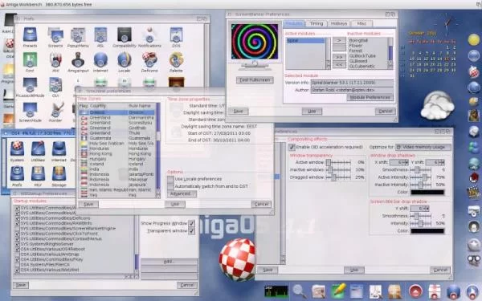
(Fonte da imagem: Reprodução/AmigaOS)

Mesmo sendo um novato, em suas primeiras versões, o sistema já oferecia interface gráfica. Ele não devia muita coisa para os concorrentes, mas a corrida era difícil na época. Apesar de não ser um estouro de vendas, o AmigaOS existe até hoje e funciona em máquinas com arquitetura PowerPC.

1985 - Windows 1.0
Indisponível
Código fechado
Correndo atrás do prejuízo, a Microsoft lançou seu primeiro sistema com interface gráfica e suporte para múltiplas tarefas. O software da MS copiou algumas coisas do Macintosh, mas ele era bem diferente em diversos aspectos. Este sistema rodava sobre o MS-DOS, mas já trazia alguns drivers avançados para melhorar a usabilidade.

1985 - RISC/os
Indisponível
Código compartilhado
Após diversos sistemas baseados no Unix, alguns começaram a misturar elementos do código-base com os de outros softwares. O RISC/os, por exemplo, trazia elementos do BSD e algumas características do UNIX. Este foi um dos primeiros sistemas com arquitetura de 64 bits, mas ele não deu muito certo e logo foi descontinuado.

1986 – GEOS
Disponível
Código fechado
Conforme os anos passavam, mais empresas adotaram a ideia da interface gráfica para sistemas. O GEOS foi um software da Berkeley Softworks que equipou computadores Commodore. Ele já vinha com um processador de textos e um programa para desenhos. O último descendente deste SO apareceu em 2009, mas ele ainda é muito rudimentar.

1986 - LynxOS
Disponível
Código fechado
Tentando fugir do trivial, este sistema chegou para oferecer processamento de operações em tempo real. Em vez de usar dados temporários, o LynxOS trabalhava para oferecer resultados imediatos. Ele é um sistema bem comum para aviação, telecomunicações, controle de processos industriais e outras atividades.

1987 - MINIX
Disponível
Código aberto
Depois de tantas versões do Unix voltadas a grandes empresas e sistemas domésticos, um homem chamado Andrew S. Tanenbaum lançou um software simplificado para fins educacionais. O MINIX foi uma das inspirações para o lançamento do aclamado Linux.

1987 - OS/2
Indisponível
Código fechado
Depois do MS-DOS e do Windows, a Microsoft e a IBM estavam pensando em lançar um sistema mais evoluído. O Operating System/2 trazia uma interface gráfica mais evoluída. Ele foi criado especialmente para os novos computadores da IBM e depois de algum tempo a Microsoft saiu do projeto.

1987 - Windows 2.0
Indisponível
Código fechado
Enquanto dava alguma atenção ao OS/2, a Microsoft ainda desenvolvia em paralelo o Windows 2.0. A nova versão do sistema começava a dar alguns passos para chegar ao que conhecemos hoje. Agora, as janelas podiam se sobrepor umas às outras e já existiam os recursos maximizar e minimizar.

1988 - A/ROSE e System 6
Indisponível
Código fechado
A Apple continuou investindo em seu sistema, mas o System 6 não foi o melhor movimento da empresa. Ele trouxe alguns recursos pouco inteligentes (como o MacroMaker que servia para automatizar as atividades) e não mostrou grande evolução.

Ao mesmo tempo, a Apple apostou em um sistema que rodava na plataforma de coprocessamento do Macintosh. O A/ROSE deveria facilitar a introdução de novos hardwares nos computadores da Maçã, mas, infelizmente, o sistema tinha uma série de problemas.

1989 – NeXTSTEP
Indisponível
Código fechado
Depois que saiu da Apple, Steve Jobs fundou a NeXT. Sua nova empresa desenvolveu o sistema NeXTSTEP, o qual era baseado no Unix e contava com códigos do BSD. O sistema já vinha com interface gráfica, um dock (tal qual o dos futuros sistemas da Apple), widgets 3D, comandos para arrastar itens e ícones totalmente coloridos. Esse foi o começo do OS X.

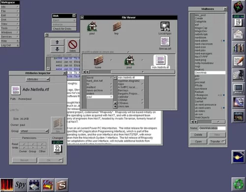
(Fonte da imagem: Reprodução/Wikipedia)

1990 - Windows 3.0
Indisponível
Código fechado
O Windows 3.0 apresentou algumas evoluções, principalmente no que diz respeito ao suporte de hardware. Este sistema era capaz de trabalhar com os processadores Intel 8086/8088, 80286 e 80386. Além disso, ele era compatível com adaptadores gráficos de 256 cores. Foi um sistema usado por muitos brasileiros.

1991 - Linux
Disponível
Código aberto e livre
Finalmente, depois de vinte e tantos anos de história, nasceu o Linux. Apesar de não ser o sistema preferido de muitos, o pinguim foi um dos mais importantes da história, visto que trazia código livre e aberto.

De início, o sistema de Linus Torvalds aproveitou bibliotecas e aplicações do GNU. O curioso desse sistema é que ele não se popularizou como uma plataforma única. Desde o começo, Torvalds distribuiu o Kernel do sistema de forma gratuita, garantindo que diversos outros sistemas pudessem ser desenvolvidos e oferecer novas experiências para os usuários.

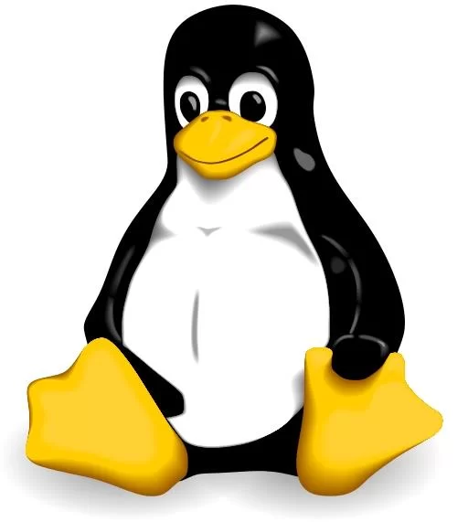
(Fonte da imagem: Divulgação/Larry Ewing, Simon Budig, Anja Gerwinski)

O Linux continua em desenvolvimento constante, sendo que seu núcleo principal é atualizado para englobar novas tecnologias e melhorias. O principal destaque desse software é que ele somente evoluiu e não precisou se preocupar com interface gráfica e outros adicionais. Atualmente, o sistema está na versão 3.11.

1991 - System 7
Indisponível
Código fechado
O lançamento do System 7 (ou Mac OS 7) foi uma etapa importante na história da Apple. Esse sistema já veio consolidado e agregou uma série de novos recursos para o utilizador. Graças à evolução também dos componentes de hardware e periféricos, esse software agradou aos consumidores. Ele foi o primeiro sistema da Apple a ser disponibilizado em CD.

1991 - BeOS
Disponível (como Haiku)
Código fechado
Pensando nas possibilidades de explorar arquivos de multimídia e trabalhar com imagens e vídeos, a Be desenvolveu o BeOS. O sistema da Be veio para competir diretamente com o Windows e o Mac OS. Assim como os concorrentes, ele também trabalhava com janelas, menus e outros recursos. O projeto acabou, mas ele continua disponível como Haiku.

1991 - Workplace OS
Indisponível
Código fechado
De tempos em tempos, a IBM tentava criar novos sistemas para seus computadores. Desta vez, a companhia apostou em uma plataforma para rodar quase tudo. O Workplace OS era capaz de executar programas de DOS, OS/2, AIX, Windows e outros.

Ele era baseado na arquitetura PowerPC e trazia parte dos códigos do UNIX. Foi descontinuado devido ao desempenho insatisfatório e à baixa aceitação do público.

1992 - Windows 3.1
Indisponível
Código fechado
O Windows 3.1 uma interface de rede mais bem desenvolvida, com melhor suporte para a execução de arquivos multimídia e fontes TrueType. Em apenas dois meses, a versão 3.1 vendeu 3 milhões de cópias. Ele foi um sistema muito popular no Brasil na década de 1990.

1992 – Solaris
Disponível
Código fechado
Dando continuidade ao SunOS, a Sun Microsystems lançou o Solaris. O novo sistema também era baseado no UNIX e, para dar continuidade a sua ideia original, a Sun continuou focando em servidores e estações de trabalho. Assim como os demais sistemas, o Solaris trazia uma interface gráfica própria e um ambiente de trabalho evoluído.

1993 – Debian
Disponível
Código aberto e livre
Dois anos depois do nascimento do Linux, surgiu um dos maiores sistemas de todos os tempos. O Debian chegou com os dois pés no peito das companhias gigantes mostrando tudo que o Pinguim tinha a oferecer. O sistema da Debian Project reunia o Kernel do Linux (uma adaptação de uma versão prévia conhecida com SLS) e as ferramentas do GNU.

Um dos grandes destaques dele foi o apoio às mais diferentes arquiteturas. O Debian roda em x86, x64, PowerPC, SPARC, ARM, MIPS, S390 e IA-64. Devido à versatilidade, o sistema ganhou muitos descendentes, incluindo o Ubuntu. Atualmente, ele tem uma base gigante de dados e pode se adaptar facilmente a quaisquer necessidades. É um dos sistemas Linux mais usados.

1993 – FreeBSD, NetBSD
Disponível
Código aberto
Nessa época, a corrida de sistemas operacionais estava cada vez mais insana. Todos tinham novas ideias e queriam entrar no mercado. Em 1993, a Berkeley Software Distribution lançou o NetBSD, e a companhia The FreeBSD Project disponibilizou o FreeBSD. Os dois sistemas ainda existem e são gratuitos.

1993 – Slackware
Disponível
Código aberto e livre
Paralelamente com o Debian, nasceu outra grande versão do Linux. O Slackware também era baseado no SLS e no Kernel do Linux. Ele chegou para oferecer facilidade com alguns scripts. Considerando o longo tempo de evolução, essa distribuição também tem uma enorme base de dados e ganhou muitos descendentes.

1994 - Copland (System 8)
Indisponível
Código fechado
A oitava versão do sistema da Apple viria para trazer mais segurança e melhorar o sistema multitarefa. Ocorre, no entanto, que o software teve uma vida muito curta, visto que a Apple logo adquiriu a NeXT e começou a trabalhar em um novo sistema.

1994 - SUSE
Disponível
1995 - Red Hat
Disponível
1995 - Windows 95
Indisponível
Código fechado
O Windows 95 foi tão importante que acabou definindo alguns padrões. A forma como o desktop é organizado, a qual ainda é utilizada no Windows 7 e 8, o Menu Iniciar (que só foi removido na última versão do Windows), a barra de tarefas e o Windows Explorer foram novidades que facilitaram a utilização do sistema.

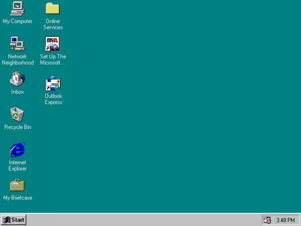
(Fonte da imagem: Reprodução/Wikipedia)

Depois de algumas atualizações, o Windows 95 passou a suportar a leitura de dispositivos USB, o navegador Internet Explorer (que jamais saiu do sistema da Microsoft) e outras funções. Este sistema foi o responsável por tornar o Windows o sistema mais usado do mundo.

1996 - Rhapsody
Indisponível
Código fechado
Enquanto trabalhava no NeXTSTEP, a Apple resolveu lançar um sistema intermediário para agradar seus usuários. O Rhapsody era um software adaptado do OPENSTEP e tinha uma interface muito parecida com a do Mac OS. Sua vida não foi tão curta, pois a empresa demorou em lançar o OS X

1997 - Symbian
Disponível
Um dos primeiros sistemas mobile foi o Symbian. Ele equipou uma série de celulares da Nokia e de outras fabricantes. Durante mais de dez anos, o software foi atualizado para se adaptar as tendências mais recentes. O sistema acabou morrendo (mas ainda há suporte) nas mãos da Nokia.

1998 - Windows 98
Indisponível
Substituindo o Windows 95, a nova versão do sistema também era capaz de rodar programas de 16 e 32 bits. Seus principais diferenciais eram o suporte já nativo para dispositivos USB e para drivers mais avançados. Além disso, ele vinha com o DirectX 5, que garantia a execução de jogos mais avançados.

1998 - Mandrake (Mandriva)
Disponível
1999 - Windows 98 SE
Indisponível
Código fechado
Como o próprio nome sugere, a Segunda Edição do Windows 98 veio para corrigir as falhas do antecessor. As melhorias foram realizadas na comunicação de rede, no suporte para drivers e na atualização do DirectX.

1999 - Yellow Dog Linux
Disponível
Apesar de ser desconhecido por muitos, o Yellow Dog Linux é um sistema de código aberto e livre que continua bem vivo. Essa versão do Pinguim é exclusiva para arquiteturas PowerPC. Ele utiliza boa parte do código do Red Hat e traz alguns softwares instalados por padrão.

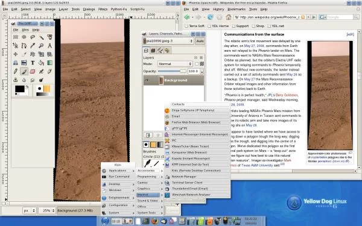
(Fonte da imagem: Reprodução/Wikipedia)

Devido a sua arquitetura, o sistema precisa usar versões alternativas do Flash e de outros programas. Esse foi também um dos poucos sistemas Linux que funcionava perfeitamente no PlayStation 3. A última versão, lançada em 2012, ainda contava com o Kernel 2.6 do Linux.

2000 - Windows 2000
Indisponível
Código fechado
Desenvolvido especialmente para servidores e clientes de rede, o Windows 2000 (NT 5.0) suportava o NTFS 3.0, sistema de encriptação de arquivos e outros recursos avançados. Ele foi substituído pelo Windows 2003.

2000 - Windows ME
Indisponível
Código fechado
A Microsoft vinha acertando em suas apostas, mas ela provou que podia dar grandes mancadas. O Windows ME foi o sistema com a maior quantidade de bugs que a empresa lançou. Além de ser lento, ele focava apenas em alguns recursos visuais que não ajudaram o sistema a ficar vivo por muito tempo.

2000 - Knoppix
Disponível
Entre tantas versões de Linux, o Knoppix recebeu certa atenção na época de seu lançamento. Baseado no Debian, o sistema chegou para oferecer os recursos do sistema livre sem a necessidade de realizar uma instalação. Bastava colocar o CD do Knoppix no PC e começar a desfrutar de um Linux muito leve.

2001 - Windows XP
Indisponível (suporte acaba a partir de 2014)
Código fechado
Devido ao desastre do Windows ME, a Microsoft caprichou no Windows XP. Este foi, provavelmente, o sistema mais usado por todos. Ele teve sua interface completamente remodelada, trouxe uma série de novos recursos para redes, DirectX 8.1, suporte avançado para múltiplos usuários, novos recursos de segurança e muito mais. Esse sistema ganhou muitas atualizações.

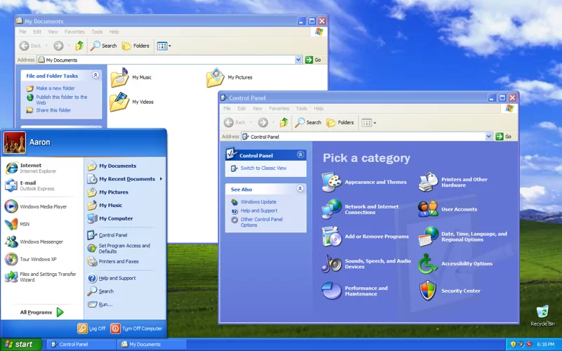
(Fonte da imagem: Reprodução/Wikipedia)

2001 - OS X
Indisponível
Código fechado
Após tantos anos trabalhando em seu sistema próprio, a Apple finalmente lançou um sistema baseado no UNIX. O OS X veio para revolucionar a história da companhia. Desde o lançamento desse sistema, a Apple vem apenas realizando melhorias e não lançou uma versão totalmente nova.

O Mac OS X, como também era chamado, trazia memória protegida, o dock (semelhante ao que é usado até hoje), o terminal, um cliente de email, suporte para OpenGL e outros tantos recursos.

2002 - Gentoo Linux
Disponível
2003 - Fedora
Disponível
2003 - Kurumin
x86 e x64
Descontinuado
Código aberto
Entre tantas versões de Linux, uma, em específico, recebeu atenção especial dos brasileiros: o Kurumin. O sistema criado por Carlos E. Morimoto foi criado com base no Debian e aproveitou a característica de funcionamento direto pelo CD (algo que foi introduzido Knoppix).

Além dessa funcionalidade, o Kurumin ficou famoso por trazer alguns recursos automáticos. O sistema contava com o “ClicaAki” (o Painel de Controle do Kurumin), que, na verdade, era uma loja simplificada que baixava e instalava os programas em poucos cliques.

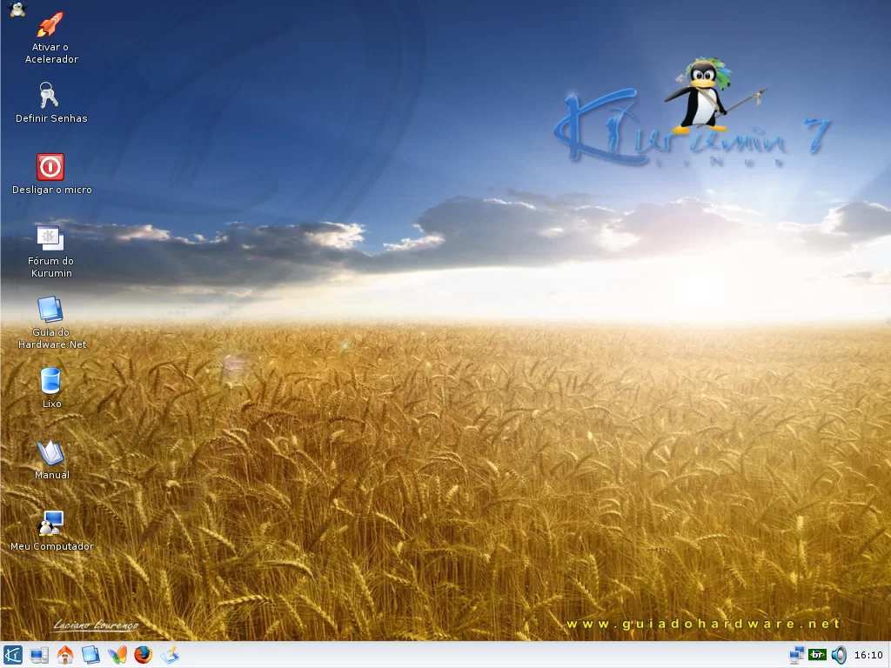
(Fonte da imagem: Reprodução/Wikipedia)

Infelizmente, o Kurumin foi descontinuado em 2009. A última versão do sistema foi a NG 8, a qual era baseada no Ubuntu 8. Este foi um sistema que vai deixar saudades.

2004 - Ubuntu
i486, x86, x64 e ARM
Disponível
Atualizações em desenvolvimento
Código aberto e gratuito
Depois de 13 anos da invenção do Linux, nasce o sistema que, hoje, é o mais popular com a cara do Pinguim. Baseado no Debian, esse sistema deixou as coisas mais amigáveis para o usuário. O Ubuntu recebe duas atualizações anuais e conta com suporte avançado para os mais variados tipos de hardware (incluindo placas NVIDIA e AMD).

2004 - Mac OS X Tiger
IA-32, x86-64 e PowerPC
Disponível
Código fechado (com componentes de código aberto)
Este foi o primeiro sistema da Apple a suportar os processadores da Intel. Em quatro anos de desenvolvimento, a Maçã adicionou a seu sistema os seguintes recursos: Dashboard, Smart Folders, Spotlight e outras ferramentas.

2006 - Linux Mint
i486, x86 e x64
Disponível
Código aberto e gratuito
2006 - OpenSUSE
IA-32, x86 e x64
Disponível
Código aberto e gratuito
2006 - Windows Vista
IA-32, x86 e x64
Disponível
Código fechado
Tentando inovar, a Microsoft acabou dando outra mancada. O Windows Vista veio para criar uma nova experiência e atrair os usuários do Windows XP. Por conta de uma série de problemas de desempenho, o sistema não obteve sucesso na missão. Apesar disso, alguns recursos (como o Windows Search e o Windows Aero) foram inovações que ajudaram no desenvolvimento do sistema sucessor.

2007 - iOS
ARM e arquiteturas proprietárias
Disponível
Atualizações em desenvolvimento
Código fechado
A grande revolução no mercado de celular ocorreu quando a Apple lançou o famoso iPhone. Na época, não havia nada semelhante ao smartphone e sistema da Maçã. O iOS foi criado com base no OS X e introduziu ao mundo recursos de fácil uso. Recentemente, o sistema passou por uma reformulação em seu visual e continua dando passos largos na introdução de novos recursos.

2008 - OpenSolaris
SPARC, IA-32, x86, x64, PowerPC, System z on z/VM e ARM
Descontinuado
Código aberto e gratuito
2008 - Android
ARM, x86, MIPS e i.MX
Disponível
Atualizações em desenvolvimento
Código aberto (com drivers proprietários)
Anteriormente desenvolvido pela Android Inc., o Android foi adquirido pela Google ainda em 2005. De lá para cá, a gigante das buscas veio trabalhando para conquistar o mercado móvel. Hoje, o Android é o sistema portátil mais usado do mundo, sendo que ele vem ganhando destaque por ser pioneiro no lançamento de diversos recursos. A versão mais recente é a 4.3, que já traz suporte para o Open GL ES 3.0.

2009 - WebOS
ARM
Disponível
Código aberto
2009 - Windows 7
IA-32, x86 e x64
Disponível
Código fechado
Considerando as decepções do Windows Vista, a Microsoft novamente resolveu correr atrás do prejuízo. O Windows 7 vem para corrigir todos os problemas do antecessor e oferecer desempenho acima de tudo. O sistema não alcançou a apreciação que o Windows XP teve, mas conseguiu conquistar o público.

2009 - Mac OS X Snow Leopard
x86 e x64
Disponível
Código fechado (com componentes de código aberto)
Diferente das atualizações prévias do OS X, o Snow Leopard veio para melhorar a programação básica do sistema. O Finder e o Safari ficaram mais rápidos e o sistema apresentou respostas imediatas. Parte dessa evolução foi o término do suporte para a arquitetura PowerPC.

2010 - Windows Phone
ARM
Disponível
Código fechado
Depois de insistir longos anos no Windows Mobile (que era apenas uma versão mal-adaptada do sistema para desktop), a Microsoft remodelou seu sistema para portáteis. O Windows Phone conta com ícones grandes, tiles, um design muito limpo e compatibilidade com APIs modernas para a execução de jogos tridimensionais.

(Fonte da imagem: Tecmundo/Baixaki)

2010 - Bada
ARM
Substituído pelo Tizen
Código misto (aberto e proprietário)
Cansada de usar sistemas genéricos, a Samsung tentou criar um para sua linha especial de aparelhos. A ideia não foi muito boa e a fabricante coreana cada vez mais vem apostando no Android. O sistema foi descontinuado para focar no desenvolvimento do Tizen.

2011 - Chrome OS
x86 e ARM
Disponível
Código aberto
Recursos na nuvem
Após conquistar o sistema de dispositivos móveis, a Google enxergou uma brecha no mercado de desktops. Em vez de insistir na computação local, a empresa criou um software que utiliza recursos na nuvem. O Chrome OS é desenvolvido pela Google e está disponível nos Chromebooks, mas há uma versão de código aberto chamada Chromium OS que pode ser testada em outros computadores.

2011 - Mac OS X Lion
x86 e x64
Disponível
Código fechado (com componentes de código aberto)
Aproveitando algumas características do iOS, a Apple evoluiu o sistema para computadores. No Lion, o Launchpad foi um dos grandes recursos que facilitou o acesso às aplicações. Outra novidade foi o salvamento automático do estado do computador e dos documentos.

(Fonte da imagem: Reprodução/Apple)

2012 - Tizen
x86 e ARM
Disponível
Código misto (aberto e proprietário)
Depois de tentar batalhar no segmento móvel apostando no Bada, a Samsung resolveu apostar em um projeto mais ousado. Desenvolvido em parceria com a Intel e a Linux Foundation, o Tizen promete oferecer bom desempenho, compatibilidade com aplicativos de Android e interface agradável. Confira nossas primeiras impressões clicando aqui.

2012 - Windows 8
x86, x64, IA-32 e ARM
Disponível
Atualizações em desenvolvimento
Código fechado
Pensando em migrar para o setor dos tablets e revolucionar a forma como as pessoas usam os PCs, a Microsoft apostou em uma reformulação de seu sistema. Aproveitando elementos do Windows Phone, o novo Windows 8 trouxe um novo Menu Iniciar. Além disso, ele mantém a compatibilidade com os antigos programas e traz suporte para novos apps.

(Fonte da imagem: Reprodução/Microsoft)

2013 - Ubuntu Touch
x86 e ARM
Em desenvolvimento
Código aberto
Tal qual a Microsoft, a Apple e a Google, a equipe do Ubuntu também decidiu criar seu próprio sistema para smartphones e tablets. O Ubuntu Mobile OS (também conhecido como Ubuntu Touch) impressionou com seu visual inovador e funcionalidades que podem garantir experiências similares entre diferentes dispositivos. O sistema deve ser lançado em breve.

2013 - Firefox OS
ARM
Em desenvolvimento
Código aberto
Depois de tantos anos trabalhando com navegadores, a Mozilla entra de cabeça no mercado mobile. O Firefox OS é um sistema enxuto focado em HTML5 que visa conquistar os consumidores que buscam smartphones mais baratos. Você pode conferir nossas primeiras impressões clicando aqui.

(Fonte da imagem: Reprodução/Mozilla)

2013 - Xbox OS
x86
Em desenvolvimento
Código fechado
Adotando parte do código do Windows, o Xbox OS será o sistema que equipará o Xbox One. Ainda não há detalhes precisos sobre o software deste video game, mas é sabido que ele terá seu código enxuto para focar na execução do Direct3D e nos recursos especiais do console.

2013 - Orbis OS
x86
Em desenvolvimento
Código fechado
Encerrando nosso artigo, temos outro sistema voltado a video games. Apesar de ainda não estar disponível para público, já temos alguns detalhes sobre o Orbis OS. O sistema do PlayStation 4 será baseado no FreeBSD e vai oferecer ferramentas incrivelmente adaptadas para a jogatina, edição de vídeos e conectividade com a web.

## SO Unix

A história do Unix remonta à década de 1960, no Laboratório Bell da AT&T (American Telephone and Telegraph Company), nos Estados Unidos. O desenvolvimento do Unix está fortemente ligado aos nomes de Ken Thompson, Dennis Ritchie, e outros colaboradores do laboratório. Aqui estão os principais marcos na história do Unix:

Início (1960-1970):

Em 1969, Ken Thompson iniciou o desenvolvimento do Unix no Laboratório Bell da AT&T. Ele estava inicialmente trabalhando em um projeto chamado Multics (Multiplexed Information and Computing Service), mas devido a limitações e restrições, ele começou a trabalhar em seu próprio sistema operacional.
Desenvolvimento (1970-1973):

Ken Thompson e Dennis Ritchie, entre outros, continuaram a desenvolver o Unix. Eles reescreveram o sistema em linguagem de programação C, o que facilitou a portabilidade do sistema para diferentes arquiteturas de hardware. A mudança para C também permitiu um desenvolvimento mais eficiente e rápido do sistema.
Versões e Distribuições (1973-1983):

A primeira versão do Unix foi lançada internamente no Laboratório Bell em 1971. A terceira versão, conhecida como Unix V3, foi amplamente distribuída em universidades e instituições de pesquisa. As versões subsequentes (V4, V5, etc.) seguiram, e o Unix ganhou popularidade entre acadêmicos e pesquisadores.
BSD Unix (1977):

A Universidade da Califórnia em Berkeley começou a desenvolver sua própria versão do Unix chamada BSD (Berkeley Software Distribution). O BSD Unix trouxe várias melhorias e adições ao sistema operacional.
GNU Project (1983):

Richard Stallman iniciou o Projeto GNU para desenvolver um sistema operacional completamente livre e de código aberto. Embora o kernel do GNU tenha demorado a ser desenvolvido, o projeto GNU incluiu muitos utilitários e ferramentas que se tornaram componentes essenciais do Unix.
GNU/Linux (1991):

Linus Torvalds lançou o kernel Linux em 1991. O Linux combinado com as ferramentas do Projeto GNU resultou em uma versão funcional do sistema operacional tipo Unix conhecido como GNU/Linux.
Comercialização e Variedades (1980s-1990s):

Empresas começaram a comercializar versões do Unix, cada uma com suas implementações e modificações. Entre as variantes comerciais estão o System V, HP-UX, AIX, Solaris, entre outros.
Padronização (1980s-1990s):

Várias tentativas foram feitas para padronizar o Unix, resultando nas especificações POSIX (Portable Operating System Interface) que buscavam garantir a compatibilidade entre diferentes implementações de Unix.
Open Source e Linux (1990s-2000s):

O movimento open source ganhou força, e o Linux se tornou uma opção popular de sistema operacional Unix-like. Empresas como a Red Hat e a SuSE surgiram para oferecer suporte comercial ao Linux.
Unix Hoje:

O Unix continua a ser uma influência significativa no desenvolvimento de sistemas operacionais. Suas ideias e princípios estão presentes em muitos sistemas, incluindo os sistemas operacionais BSD, GNU/Linux, macOS e outros. O Unix também desempenhou um papel fundamental na evolução da internet e no desenvolvimento de tecnologias relacionadas.

### GNU Bash

Acrônimo para "Bourne-Again SHellBash ou Shell foi idealizado por Steven Bourne em 1977. Anos depois, mais exatamente em 1984, quando o Projeto GNU precisava clonar o Unix, a equipe liderada por Brian Fox precisou de um shell.
GNU Bash ou simplesmente Bash é um interpretador de comandos, um entre os diversos tradutores entre o usuário e o sistema operacional conhecidos como shell. Acrônimo para "Bourne-Again SHell", o Bash é uma evolução retro-compatível muito mais interativa do Bourne Shell.

## SO Minix

O MINIX é um sistema operacional de computador de código aberto, baseado em Unix-like, criado pelo professor Andrew S. Tanenbaum na década de 1980. A história do MINIX está intimamente ligada à discussão sobre o design de sistemas operacionais e à famosa correspondência conhecida como a "tanenbaum-torvalds debate" entre Andrew S. Tanenbaum e Linus Torvalds, o criador do Linux.

Aqui estão alguns marcos importantes na história do MINIX:

Início do Desenvolvimento (1987): Andrew S. Tanenbaum começou a desenvolver o MINIX como um sistema operacional educacional para ensinar os princípios de sistemas operacionais aos alunos da Universidade Livre de Amsterdã.

Versão 1.0 (1987): A primeira versão do MINIX foi lançada como um livro chamado "Operating Systems: Design and Implementation", escrito por Tanenbaum. O livro incluía o código-fonte do MINIX, permitindo que os leitores o utilizassem e explorassem.

A Tanenbaum-Torvalds Debate (1992): Em uma série de postagens em grupos de discussão na Usenet, Tanenbaum e Linus Torvalds, criador do Linux, debateram sobre as abordagens de design de seus sistemas operacionais. Torvalds argumentou a favor de um núcleo monolítico (como no Linux), enquanto Tanenbaum defendeu a abordagem microkernel do MINIX.

MINIX 2 (1997): Tanenbaum lançou a versão 2 do MINIX, que incluía melhorias significativas e suporte para mais hardware. No entanto, ainda era principalmente usado para fins educacionais e não tinha a mesma visibilidade que o Linux.

MINIX 3 (2005): Uma versão mais recente do MINIX, conhecida como MINIX 3, foi lançada. Esta versão foi projetada com um foco em confiabilidade e segurança, sendo adequada para sistemas embarcados e aplicações críticas.

Impacto Educacional: Ao longo dos anos, o MINIX teve um impacto significativo na educação em ciência da computação, sendo usado em cursos de sistemas operacionais para ensinar conceitos fundamentais aos estudantes.

MINIX 3 no Livro-Texto (2016): O livro-texto "Operating Systems: Principles and Practice" de Tanenbaum e Herbert Bos foi lançado, destacando o MINIX 3 como um sistema operacional moderno e confiável.

Licença BSD (2019): Em 2019, Tanenbaum mudou a licença do MINIX 3 para a Licença BSD para permitir uma colaboração mais ampla e facilitar a integração do MINIX com outros projetos.

Embora o MINIX nunca tenha alcançado a mesma popularidade que o Linux, ele desempenhou um papel importante na educação em sistemas operacionais e contribuiu para o debate sobre arquiteturas de sistemas operacionais.

https://www.minix3.org/

Linux

A história do Linux remonta ao início da década de 1990, com o surgimento de um jovem estudante finlandês chamado Linus Torvalds. Linus estava cursando ciência da computação na Universidade de Helsinki e, insatisfeito com o sistema operacional que usava, decidiu criar seu próprio kernel. O kernel é a parte central de um sistema operacional, responsável por gerenciar os recursos do hardware.

Em 1991, Linus lançou a primeira versão do kernel do Linux, chamada de versão 0.01. Ele compartilhou seu trabalho de forma gratuita na Internet, incentivando outros desenvolvedores a contribuir para o projeto. Isso deu início a uma colaboração global que se expandiu rapidamente.

O sistema operacional em torno do kernel Linux foi construído usando o software GNU (GNU's Not Unix), um projeto de software livre iniciado por Richard Stallman. A combinação do kernel Linux com as ferramentas do projeto GNU formou o que é conhecido como sistema operacional Linux.

O modelo de desenvolvimento do Linux é baseado no código aberto, o que significa que o código-fonte do sistema operacional é livremente acessível e modificável por qualquer pessoa. Essa abordagem colaborativa permitiu que o Linux se desenvolvesse rapidamente, adaptando-se às necessidades de uma ampla variedade de usuários.

Ao longo dos anos, o Linux ganhou popularidade em diferentes áreas, desde servidores e dispositivos embutidos até sistemas de desktop. Diversas distribuições Linux foram criadas, como o Debian, Ubuntu, Red Hat, Fedora e muitas outras, cada uma adaptada para atender a diferentes requisitos e preferências dos usuários.

O Linux também é conhecido por ser estável, seguro e eficiente, tornando-se uma escolha popular para servidores e sistemas incorporados. Além disso, é frequentemente usado como sistema operacional principal em supercomputadores devido à sua capacidade de lidar com cargas de trabalho intensivas.

A filosofia do software livre e código aberto do Linux tem desempenhado um papel fundamental na sua disseminação e sucesso ao longo dos anos. O Linux continua a ser um dos sistemas operacionais mais influentes e amplamente utilizados no mundo da computação.

## IBM X Apple

A IBM tem uma longa história com sistemas operacionais, e um dos sistemas mais conhecidos associados à IBM é o IBM OS/360 e suas variantes. No entanto, nos computadores pessoais da IBM, como o IBM PC, o sistema operacional mais comum é o Microsoft Windows. A IBM também usa uma variedade de sistemas operacionais em seus servidores, como o IBM AIX (uma versão do Unix) e outros sistemas baseados em Linux.

A Apple, por outro lado, utiliza o sistema operacional macOS em seus computadores pessoais. O macOS é uma versão do Unix certificado pela Open Group. Anteriormente, a Apple também usava o sistema operacional Mac OS, que evoluiu para o macOS.

Se você puder fornecer mais detalhes ou esclarecer sua pergunta, ficarei feliz em ajudar da melhor maneira possível.

## Vale do Silício

O termo "Vale do Silício" refere-se a uma região geográfica localizada na parte sul da Baía de São Francisco, na Califórnia, nos Estados Unidos. Esta área é famosa por ser o centro global da tecnologia e inovação, abrigando muitas das maiores empresas de tecnologia do mundo.

O Vale do Silício é conhecido por ser o berço de várias empresas de tecnologia de renome, incluindo gigantes como Google, Apple, Facebook, Intel, Oracle e muitas outras. A região é um importante polo de inovação, pesquisa e desenvolvimento de tecnologia, e atrai empreendedores, investidores e profissionais de todo o mundo.

A história do Vale do Silício remonta à década de 1950, quando empresas como a Hewlett-Packard começaram a se estabelecer na área. A presença de universidades de prestígio, como a Universidade Stanford, também contribuiu para o desenvolvimento do Vale do Silício como um centro de inovação.

Além das empresas de tecnologia, o Vale do Silício também é conhecido por sua cultura empreendedora, onde startups e empresas de tecnologia emergentes buscam financiamento de investidores de risco para desenvolver e lançar novas ideias e produtos.

Em resumo, o Vale do Silício é uma região emblemática que desempenha um papel fundamental no avanço da tecnologia e da indústria de alta tecnologia.

## Os Celulares

A história do celular começa com seu primeiro lançamento em 1973, pelo engenheiro eletrônico Martin Cooper. Nos primeiros anos, os equipamentos pesavam muito e eram enormes, além de custarem gritantes US$ 4 mil. Hoje em dia, praticamente qualquer um pode ter um aparelho de baixo custo, pesando menos de 0,5 kg e menor do que a mão. Acompanhe com o TechTudo a história dos telefones celulares.

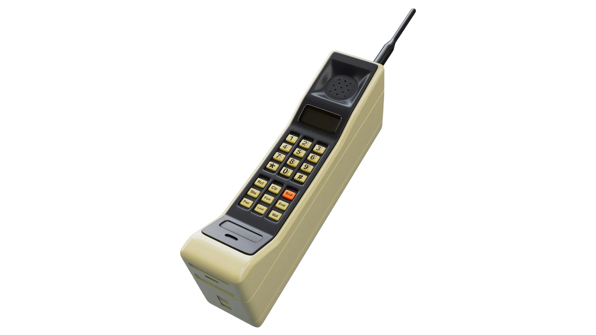

Anos 80: os primeiros anos
O ex-empregado da Motorola Martin Cooper apresentou ao mundo o primeiro celular, o Motorola DynaTAC, em 3 de abril de 1974 (cerca de um ano após a sua criação). De pé, perto do hotel New York Hilton, ele fixou uma estação base no outro lado da rua. O feito funcionou, mas apenas quase uma década depois o telefone particular finalmente chegou a público.

Em 1984, a Motorola liberou o Motorola DynaTAC ao público. Ele continha um teclado numérico de base, um display de uma linha e uma bateria deplorável com apenas uma hora de duração em tempo de conversação e 8 horas em modo de espera. Mesmo assim, era revolucionário para a época, razão pela qual apenas os mais ricos dos ricos podiam se dar ao luxo de comprar um ou pagar para o serviço de voz que custava US$ 50 por mês, não incluindo US$ 0,40/minuto durante o pico e US$ 0,24/minuto em outros horários.

O DynaTAC 8000X tinha 33 cm de altura, 4,5 cm de largura e 8,9 cm de espessura. Pesava 794 g, e era capaz de memorizar até 30 números. A tela de LED e a bateria relativamente grande mantinham o seu design meio "encaixotado". Funcionava na rede analógica, ou seja, NMT, tendo sido descontinuado apenas em 1994.

1989: a inspiração para telefones com flip
Seis anos após o DynaTAC aparecer, a Motorola deu mais um passo, apresentando o que se tornou a inspiração para o primeiro telefone de flip. Chamado de MicroTAC, este dispositivo analógico introduziu um revolucionário projeto: nele, o dispositivo de captura de voz era dobrado sobre o teclado. Além disso, ele media apenas 9 cm de comprimento e pesava menos de 0,5 kg, tornando-o o mais leve aparelho celular já produzido.

Anos 90
Foi durante os anos 90 que o tipo de tecnologia moderna de celular que você vê todos os dias começou a se formar. As primeiras mensagens de texto, processadores de sinais digitais e de alta tecnologia (redes iDEN, CDMA, GSM) brotaram durante este período tumultuoso.

1993: primeiro telefone PDA
Em 1993, a IBM e a BellSouth se uniram para lançar o Comunicador Pessoal Simon, o primeiro telemóvel a incluir funcionalidades de PDA. Não só poderia enviar e receber chamadas de voz, mas também servia como um livro de endereços, calculadora, pager e fax. Além disso, ele ofereceu pela primeira vez o touchscreen, que permitia que clientes usassem os dedos ou uma caneta para fazer chamadas e criar notas.

1996: primeiro telefone com flip
Meia década após o lançamento do MicroTAC, a Motorola lançou uma atualização conhecido como o StarTAC. Inspirado por seu antecessor, o StarTAC se tornou o primeiro telefone flip de verdade. Operou em redes GSM nos Estados Unidos, e incluía o suporte para mensagens de texto SMS, acrescentou funções digitais como uma agenda de contatos e foi o primeiro celular a suportar bateria de lítio. Além disso, o dispositivo pesava apenas 100 g.

1998: primeiro telefone em barra
Nokia apareceu em cena em 1998 com o telefone em barra, o Nokia 6160. Pesando apenas 160 gramas, o dispositivo ostentava um display monocromático, antena externa e uma bateria recarregável com um tempo de conversação de 3,3 horas. Por causa de seu preço e facilidade de uso, o Nokia 6160 acabou se tornando dispositivo mais vendido da Nokia da década de 90.

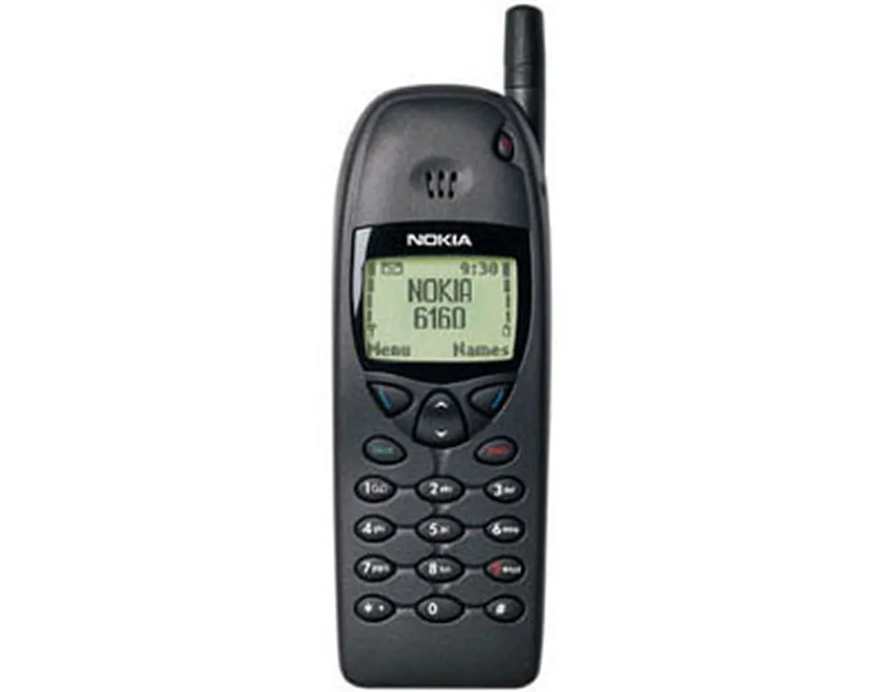

1999: precursor do smartphone BlackBerry
O primeiro dispositivo celular BlackBerry apareceu no final dos anos 90 como um Pager bidirecional. Ele apresentava um teclado QWERTY completo e poderia ser usado para transmitir mensagens SMS, e-mails e páginas. Além disso, ele ofereceu um display de 8 linhas, um calendário e um organizador. Devido a uma falta de interesse em dispositivos móveis de e-mail no momento, o aparelho foi usado tão somente por aqueles indivíduos que trabalhavam na indústria corporativa.

Anos 2000: a era smartphone
O novo milênio trouxe consigo o surgimento de câmeras integradas, redes 3G/GPRS/EDGE e smartphones, bem como a divulgação final da rede celular analógica em favor do trabalho em rede digital.

Com intuito de otimizar o tempo e trazer mais facilidades ao dia a dia, o smartphone se tornou indispensável, pois tornou possível navegar na Internet, ler e editar arquivos de textos, planilhas e acessar seus e-mails rapidamente.

2000: primeiro telefone bluetooth
O T36 Ericsson introduziu a tecnologia Bluetooth para o mundo celular, permitindo assim aos consumidores a conexão sem fio em seus telefones para seus computadores. O telefone também ofereceu conectividade no mundo inteiro através 900/1800/1900-band GSM, a tecnologia de reconhecimento de voz e Aircalendar, uma ferramenta que permitia ao consumidor receber atualizações em tempo real ao seu calendário ou agenda de contatos.

2002: primeiro smartphone BlackBerry
Em 2002 a Research in Motion (RIM) finalmente deslanchou. O PDA BlackBerry foi o primeiro a apresentar conectividade celular. Operando ao longo de uma rede GSM, o BlackBerry 5810 permitiu aos usuários enviar e-mails, organizar seus dados e preparar memorandos. Infelizmente, faltou nele um alto-falante e um microfone, ou seja, seus usuários eram obrigados a usar um fone de ouvido com um microfone acoplado.

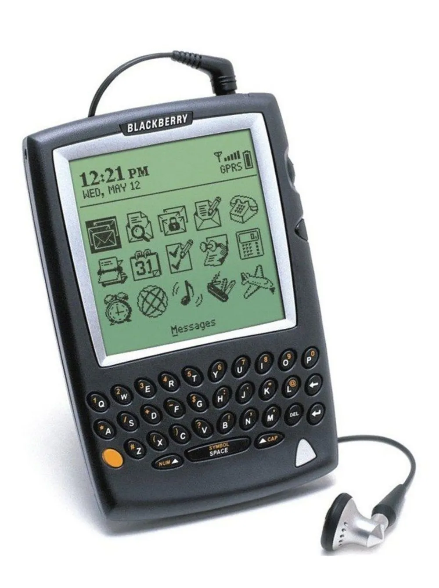

2002: primeiro celular com câmera
A Sanyo SCP-5300 eliminou a necessidade de comprar uma câmera, pois foi o primeiro aparelho celular a incluir uma câmera integrada com um botão dedicado ao snapshot. Infelizmente, foi limitado a uma resolução de 640×480, zoom digital de 4x e 3 m de alcance. Independente disso, os usuários do telefone podiam tirar fotos em movimento e depois enviá-las para o seu PC utilizando uma suíte de software.

2004: primeiro telefone ultra fino
Antes do lançamento do Motorola RAZR V3 em 2004, os telefones tendiam a serem grandes e volumosos. O Razr mudou isso com seus ínfimos 14 mm de espessura. O telefone também incluía uma antena interna, um teclado gravado quimicamente e azul de fundo. Era, em essência, o primeiro telefone criado para não só fornecer grande funcionalidade, mas também transmitir estilo e elegância.

2007: Apple iPhone
Quando a Apple entrou no setor de telefonia celular em 2007, tudo mudou. A marca substituiu o teclado convencional por um teclado touchscreen multi-touch que permitia que os clientes se sentissem como se estivessem fisicamente manipulando as ferramentas do celular com os dedos: clicar em links, alongar/encolher fotos e folhear álbuns. Além disso, ela trouxe a primeira plataforma cheia de recursos para telefones celulares. Era como se eles pegassem um sistema operacional de um computador e colocassem em um minúsculo telefone.

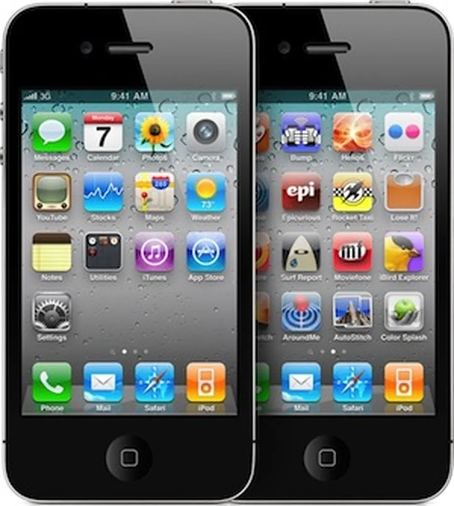

2012 até atualmente
Poucos anos se passaram desde a virada da década e a tecnologia de telefonia celular só aumenta. A tecnologia 5G está em ascensão, o iPhone já passou de sua décima geração e os smartphones mais tecnológicos podem gravar vídeos FullHD, reproduzir filmes completos e servir como um hotspot móvel para outros dispositivos. Se em tão pouco tempo o celular evoluiu tanto, imaginem quantas ferramentas estarão disponíveis para os smartphones do futuro.

## BIBLIOGRAFIA

https://www.tecmundo.com.br/linux/2031-a-historia-dos-sistemas-operacionais.htm

https://www.techtudo.com.br/noticias/2022/09/conheca-a-historia-do-celular-e-sua-evolucao-com-o-passar-dos-anos.ghtml

Alguns temas pesquisados foram fornecidos pelo ChatGPT.
